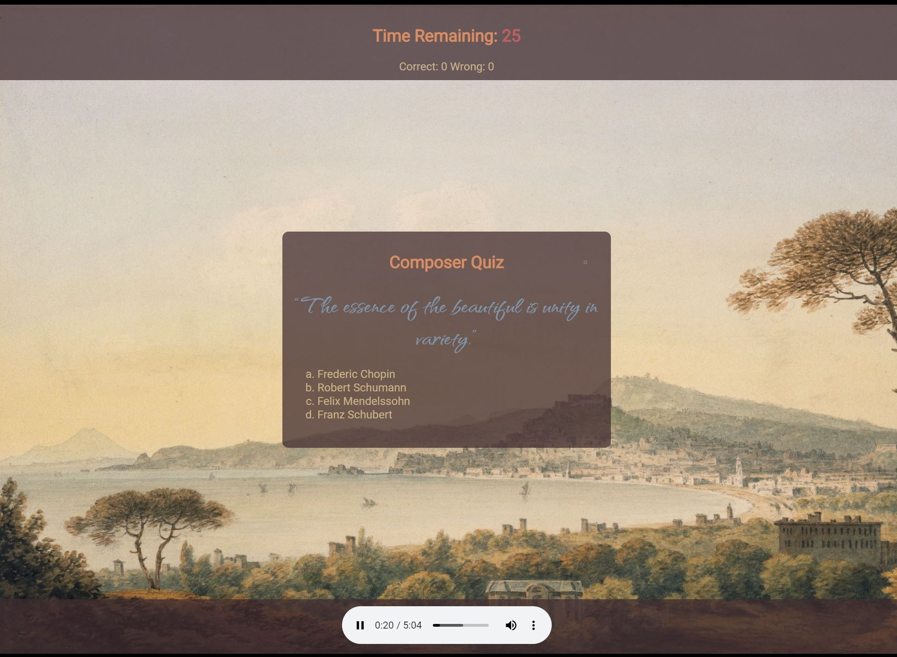

# Composer Quiz

## Description

Robust quiz game on classical composers. Includes:

-   Informational how-to landing page
-   A large selection of randomly selected quiz cards
-   Dynamically updating background image, quote, and music related to the correct composer.
-   Timer remaining function that pauses upon answering to allow user to continue enjoying music before proceeding to next question.
-   Score card displays correct and wrong answers.
-   Audio control panel at bottom of page allows user to:
    -   play
    -   pause
    -   adjust volume
    -   seek track
    -   adjust playback speed
    -   download track
-   High Scores function allows users to submit their name or initials to the high scores board.
-   Deployed to github for public use at [https://abrowncownow.github.io/composer-quiz/index.html](https://abrowncownow.github.io/composer-quiz/index.html)
-   Repo can be viewed at [https://github.com/abrowncownow/composer-quiz](https://github.com/abrowncownow/composer-quiz)

## Table of Contents

Use the links below to navigate to different sections of the README.

-   [Installation](#installation)
-   [Usage](#usage)
-   [Credits](#credits)
-   [License](#license)

## Installation

Website deployed to web via github pages for public use. No installation necessary. Recommend increasing speaker volume for best experience.

## Usage

Navigate to page in browser. Read the how-to information present throughout the page. Press the "start" button. User will be presented with a quote from a famous classical composer. The user has 45 seconds to click on the name of a composer. The quiz card will update to show the correct composer and the score card at the top of the screen will update to show on-going success. If no choice is selected after 45 seconds, the card will be marked as wrong. The user may continue to listen to music as long as they wish before proceeding. Click next to proceed. After 5 cards have been answered, the player will be given a score based on speed and accuracy. They may enter their name or initials to submit their score to high scores.

## Credits

Developed by Alex Brown. Color Pallete generated using colormind. Free-use images found on unsplash.com. Music manually recorded and encoded by Alex Brown from free-use sources.

## License

Please refer to the LICENSE in the repo.
